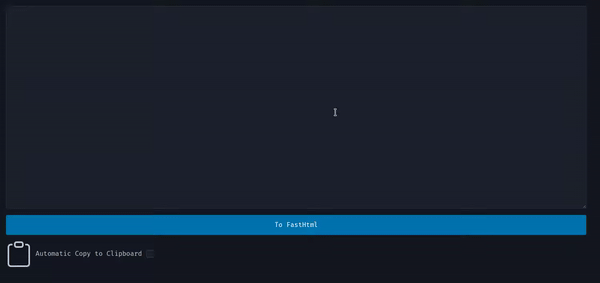

# Html2FastHtml 
Note fastHTML has an official online option [HTMLtoFT](https://h2f.answer.ai/).
This is small server meant to run locally allowing you to convert HTML to FastHTML components.
The web server is made with [FastHTML](https://github.com/AnswerDotAI/fasthtml "fasthtml github") and
   uses [ruff](https://github.com/astral-sh/ruff "Ruff github") as a code formatter by default.
You can use a the official HTMLtoFT function or my own implementation which
works by parsing the input into a tree using python's HTML parser and then traverses that tree
   generating FastHTML components. 
There are a few edge cases where they would produce different results.
Once the FastHTML component string is done it writes it to a file and then formats it.
Any formatter configuration you wish to apply should work like normal.
There are edge cases where it might not generate the correct HTML.
# demo

# setup
- Clone the repository
- Install dependencies (pip venv example below)
    - `python -m venv venv` (creates virtual environment)
    - windows: `.\venv\Scripts\activate` OR Mac/Linux `source venv/bin/activate` (activates the virtual environment)
    - `pip install -r requirement.txt` (installs required libraries: FastHTML and ruff)
- run the website locally `python main.py`
# configuration
- The formatter can be configured with the following environment variables to all for different auto formatters
    - `PATH_TO_FILE` the temp file to write the code for formatting ex: `out/fasthtml.py`
    - `AUTO_FORMATTER_CMD` the command to format said file ex: `ruff format out/fasthtml.py`
