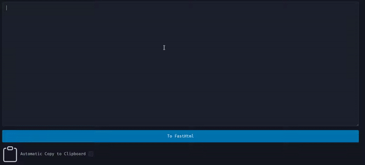

# Html2FastHtml 
This is small server to be ran locally allowing you to convert html to FastHtml components.
The web server is made with [FastHtml](https://github.com/AnswerDotAI/fasthtml "fasthtml github") and
   uses [ruff](https://github.com/astral-sh/ruff "Ruff github") as a code formatter by default.
It works by making the submitted html into a tree using python's html parser and then traverses that tree
   generating FastHtml components.
Once the FastHtml component string is done it writes it to a file and then formats it using the formatter.
Any formatter configuration you wish to apply should work like normal.
There are still some edge cases where it might not generate perfect html feel free to open
   issues and PRs.
# demo

# setup
- Clone the repository
- Install dependencies (pip venv example below)
    - `python -m venv venv` (creates virtual environment)
    - windows: `.\venv\Scripts\activate` OR Mac/Linux `source venv/bin/activate` (activates the virtual environment)
    - `pip install -r requirement.txt` (installs required libaries: fasthtml and ruff)
- run the website locally `python main.py`
# configuration
- The formatter can be configured with the following environment variables to different auto formatters
    - `PATH_TO_FILE` the temp file to write the code for formatting ex: `out/fasthtml.py`
    - `AUTO_FORMATTER_CMD` the command to format said file ex: `ruff format out/fasthtml.py`
